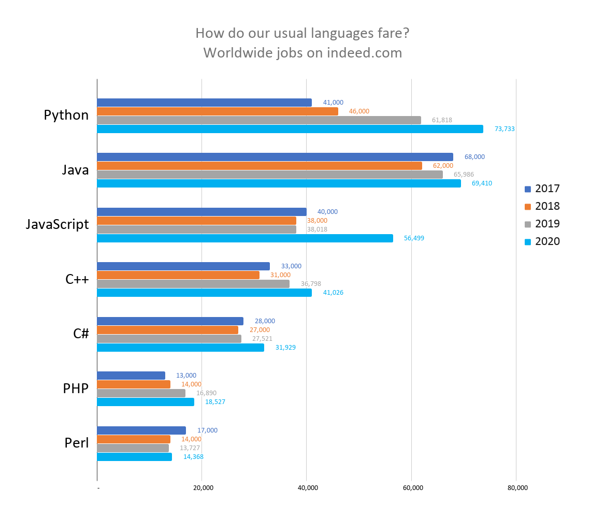

# 💻 PHP TILI ASOSLARI

## MAQSADIMIZ

Darsimizning asl maqsadi tinglovchilarga dasturlash asoslarini va eng muhimi turli muammolarga yechim bo'luvchi dasturlar yozishni o'rgatish.&#x20;

Buning uchun biz Python tilidan foydalansakda, dars davomida olingan bilimlar barcha dasturlar tili uchun umumiydir.

Darslarni boshlashdan avval, keling..

## TANISHAMIZ

Ismim **Anvar Narzullaev.**

[Universiti Sains Islam Malaysia](https://www.usim.edu.my) oliygohining Axborot Texnologiyalari kafedrasida yetakchi mutaxassis lavozimida ishlayman. Raqamli Texnologiyalar, Kompyuter Arxitekturasi, Axborot Xavfsizligi fanlaridan dars beraman.&#x20;

2004 yilda Toshkent Axborot Texnologiyalar Universitetini Telekommunikatsiya yo'nalishini bitirganman.&#x20;

2006 yilda Janubiy Koreyaning Yeungnam Universitetida Axborot Texnologiyalari Muhandisi yo'nalishida Magistrlik, 2012 yilda esa shu oliygohda Doktorlik (PhD) unvonini himoya qilganman.

2013 yildan beri Malayziyaning turli oliy o'quv yurtlarida Computer Science va Axborot Texnologiyalari yo'nalishlarida dars berib kelaman.

Birinchi professional dasturimni 13 yoshda yozganman. Turli yillar davomida C, C++, Delphi, Matlab, Java va Python tillaridan foydalanib kelganman.&#x20;

Oxirgi yillarda asosan ikki yo'nalishda ilmiy izlanishlar qilaman: IoT (Internet of things) va AI (Artificial Intelligence).&#x20;

Asosiy dasturlash qurollarim C++, Matlab va Python.

## ONLAYNDAGI MANZILLARIMIZ

SariqDev telegram kanali: [https://t.me/sariqdev](https://t.me/sariqdev)

SariqDevYoutube kanali: [https://www.youtube.com/sariqdev](https://www.youtube.com/sariqdev)

## DARSLARIMIZ KIM UCHUN?

Darslarimiz yakunida siz nafaqat Python tilini, balki barcha dasturlash tillari uchun umumiy bo'lgan tushunchalar va asoslarni ham puxta o'zlashtirib olasiz.

Kursni muvaffaqiyatli tamomlagan tinglovchilar, kelajakda dasturlashning tor va murakkab yo'nalishlarini ham, mutlaqo yangi dasturlash tilini ham yengillik bilan o'zlashtira oladilar.&#x20;

Darslarimizning **birinchi qismida** siz Python dasturlarini yozish uchun muhim bo'lgan asosiy tushunchalarni o'rganasiz. Ushbu tushunchalar xar qanday dasturlash tillari uchun bir xildir. Jumladan ushbu qism quyidagi mavzularni o'z ichiga oladi:

* Ma'lumotlar turlari va ularni saqlash usullari
* Ma'lumotlar to'plamini yaratish, ular ustida samarali ishlash usullari
* _**While, if **_ tsikllari yordamida shartlarni tekshirish va kodni tarmoqlash
* Interaktiv dasturlar yaratish orqali foydalanuvchilar bilan ikki tomonlama "muloqot" o'rnatish, ulardan ma'lumot qabul qilish
* Kodning ma'lum qismlarini qayta-qayta ishlatish uchun funktsiyalar yozish
* Yozgan dasturingizni tekshirish uchun testlar yozish, va kelajakdagi xatolarning oldini olish

Kursimizning **ikkinchi qismida** esa o'zlashtirgan bilimlaringizni puxtalash uchun bir nechta loyihalar ustida ishlaysiz.

## NIMA UCHUN AYNAN PYTHON?

**Python **— o'rganish uchun oson, foydalanish uchun qulay, ko'p qirrali dasturlash tili bo'lib, dasturlashga yangi kirganlar uchun ham, soha mutaxassislari uchun ham zo'r tanlov.

### Python o'rganish uchun 5 sabab:

1. Python dasturlash tiliga bo'lgan talab yildan yilga oshib kelmoqda. CodingDojo portalining tadqiqotlariga ko'ra, 2020 yilda aynan Python tilida dasturlovchi mutaxassislarga eng ko'p talab bo'lgan
2.

###

##
